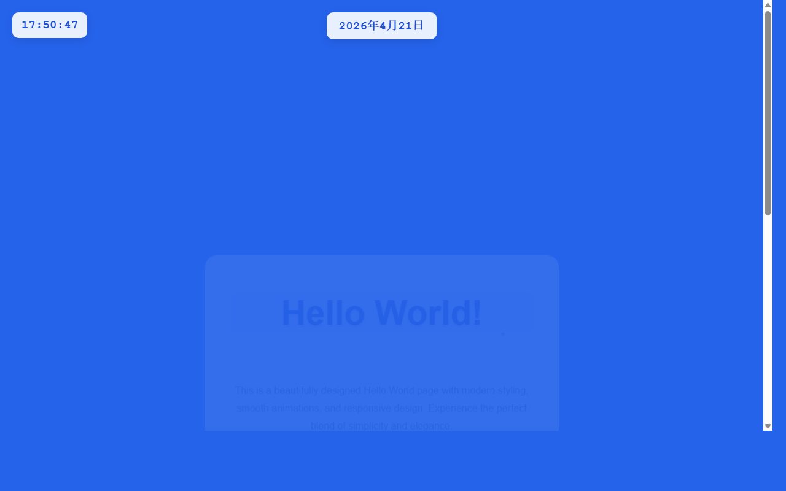

# 产品验收 — 在顶部中央添加年月日显示功能

## 结果: ✅ 通过

| 项目 | 值 |
|------|------|
| 评分 | 8/10 (通过线: 6) |
| 状态 | acceptance_passed |

## 反馈
功能实现良好。在截图中可以清楚看到页面顶部中央位置显示了日期信息'2026年4月21日'，格式完全符合需求要求（YYYY年MM月DD日）。日期显示位置准确，与左上角的时钟'17:50:47'在视觉上形成良好的对称布局。字体样式与时钟保持一致，整体UI协调美观。

## 检查清单
  1. 入口文件（index.html/main.py）是否存在且可运行
  2. 代码功能是否覆盖需求描述中的所有要点
  3. 代码风格和命名是否规范
  4. 是否有明显的 bug 或安全问题

## 运行效果截图

## 问题
无
