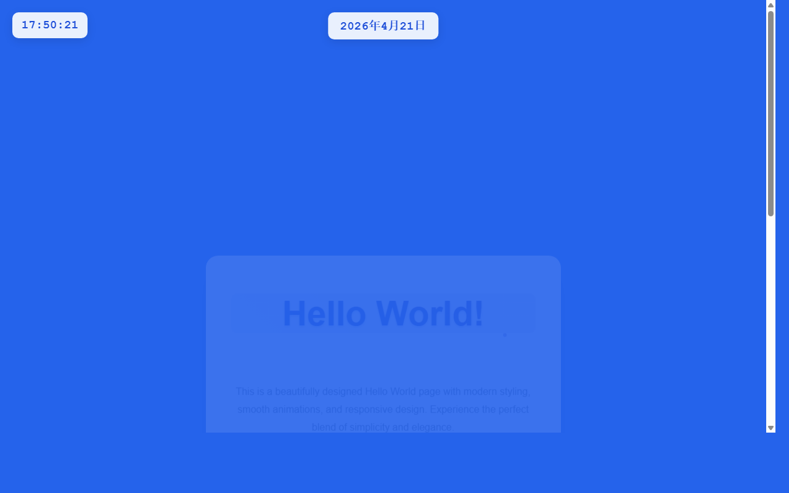

# 开发笔记 — 在顶部中央添加年月日显示功能

> 2026-04-21 17:50 | LLM

## 产出文件
- [index.html](/app#repo?file=index.html) (8285 chars)

## 自测: 自测 6/6 通过 ✅

| 检查项 | 结果 | 说明 |
|--------|------|------|
| 文件产出 | ✅ | 1 个文件 |
| 入口文件 | ✅ | 存在 |
| 代码非空 | ✅ | 通过 |
| 语法检查 | ✅ | 通过 |
| 文件名规范 | ✅ | 全英文 |
| 页面截图 | ✅ | 1 张截图 |

## 代码变更 (Diff)

### index.html (修改)
```diff
--- a/index.html
+++ b/index.html
@@ -45,6 +45,23 @@
             z-index: 1000;

         }

 

+        .date-display {

+            position: fixed;

+            top: 20px;

+            left: 50%;

+            transform: translateX(-50%);

+            background: rgba(255, 255, 255, 0.9);

+            padding: 10px 20px;

+            border-radius: 10px;

+            font-family: 'Courier New', monospace;

+            font-size: 1.2rem;

+            font-weight: bold;

+            color: #1d4ed8;

+            box-shadow: 0 4px 15px rgba(0, 0, 0, 0.1);

+            backdrop-filter: blur(10px);

+            z-index: 1000;

+        }

+

         .container {

             text-align: center;

             background: rgba(255, 255, 255, 0.95);

@@ -105,5 +122,160 @@
             text-shadow: 0 1px 2px rgba(107, 114, 128, 0.1);

         }

 

-        .cta-butt

-... (truncated, 7046 chars)
+        .cta-button {

+            display: inline-block;

+            background: linear-gradient(45deg, #1d4ed8, #3730a3);

+            color: white;

+            padding: 15px 30px;

+            border: none;

+            border-radius: 50px;

+            font-size: 1.1rem;

+            font-weight: bold;

+            text-decoration: none;

+            cursor: pointer;

+            transition: all 0.3s ease;

+            box-shadow: 0 4px 15px rgba(29, 78, 216, 0.3);

+            text-shadow: 0 1px 2px rgba(0, 0, 0, 0.2);

+        }

+

+        .cta-button:hover {

+            transform: translateY(-2px);

... (共 189 行变更)
```

## 页面预览截图



