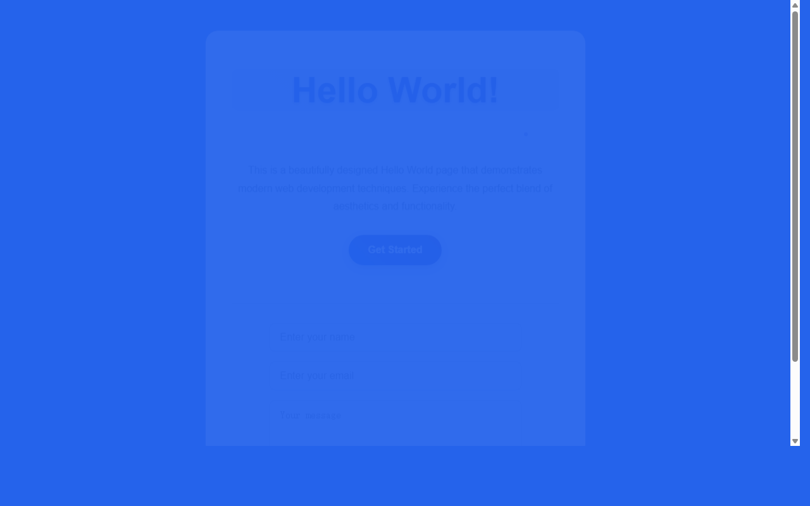

# 产品验收 — 在HelloWorld页面底部添加输入框组件

## 结果: ❌ 不通过

| 项目 | 值 |
|------|------|
| 评分 | 3/10 (通过线: 6) |
| 状态 | acceptance_rejected |

## 反馈
页面能够正常运行，但未完成核心需求。根据需求描述，应该在HelloWorld页面底部添加输入框组件，包括输入框样式设计、占位符文字设置、提交按钮配置。从截图可以看出，页面只显示了基本的HelloWorld内容，底部并没有添加所需的输入框组件。虽然页面可以正常打开，但功能完全不符合需求描述的要求。

## 检查清单
  1. 入口文件（index.html/main.py）是否存在且可运行
  2. 代码功能是否覆盖需求描述中的所有要点
  3. 代码风格和命名是否规范
  4. 是否有明显的 bug 或安全问题

## 运行效果截图

## 问题
- 页面底部缺少输入框组件
- 未实现占位符文字设置
- 未添加提交按钮
- 未完成输入框样式设计
- 功能实现与需求描述不匹配
