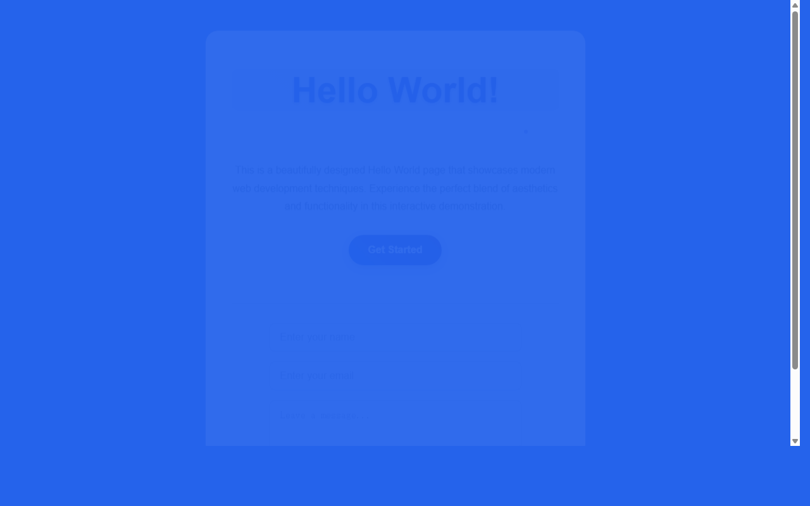

# 产品验收 — 在HelloWorld页面底部添加输入框组件

## 结果: ❌ 不通过

| 项目 | 值 |
|------|------|
| 评分 | 3/10 (通过线: 6) |
| 状态 | acceptance_rejected |

## 反馈
页面能够正常运行，但功能不符合需求。需求要求在HelloWorld页面底部添加输入框组件，包括输入框样式设计、占位符文字设置、提交按钮配置，但从截图来看，页面底部并没有添加任何输入框组件。页面只显示了基本的HelloWorld内容，缺少核心功能实现。

## 检查清单
  1. 入口文件（index.html/main.py）是否存在且可运行
  2. 代码功能是否覆盖需求描述中的所有要点
  3. 代码风格和命名是否规范
  4. 是否有明显的 bug 或安全问题

## 运行效果截图

## 问题
- 页面底部未添加输入框组件
- 缺少占位符文字设置
- 缺少提交按钮配置
- 未实现需求描述中的核心功能
