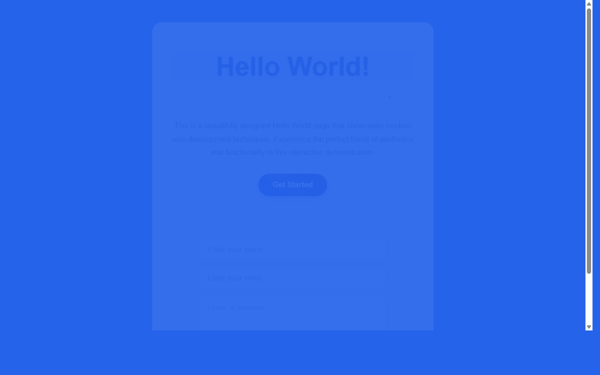

# 开发笔记 — 在HelloWorld页面底部添加输入框组件

> 2026-04-17 22:34 | LLM

## 产出文件
- [index.html](/app#repo?file=index.html) (6315 chars)

## 自测: 自测 6/6 通过 ✅

| 检查项 | 结果 | 说明 |
|--------|------|------|
| 文件产出 | ✅ | 1 个文件 |
| 入口文件 | ✅ | 存在 |
| 代码非空 | ✅ | 通过 |
| 语法检查 | ✅ | 通过 |
| 文件名规范 | ✅ | 全英文 |
| 页面截图 | ✅ | 1 张截图 |

## 代码变更 (Diff)

### index.html (修改)
```diff
--- a/index.html
+++ b/index.html
@@ -95,6 +95,7 @@
             transition: all 0.3s ease;

             box-shadow: 0 4px 15px rgba(29, 78, 216, 0.3);

             text-shadow: 0 1px 2px rgba(0, 0, 0, 0.2);

+            margin-bottom: 30px;

         }

 

         .cta-button:hover {

@@ -102,5 +103,101 @@
             box-shadow: 0 8px 25px rgba(29, 78, 216, 0.4);

         }

 

-        .features 

-... (truncated, 4963 chars)
+        .input-section {

+            margin-top: 30px;

+            padding-top: 30px;

+            border-top: 1px solid #e5e7eb;

+        }

+

+        .input-group {

+            display: flex;

+            flex-direction: column;

+            gap: 15px;

+            max-width: 400px;

+            margin: 0 auto;

+        }

+

+        .input-field {

+            padding: 12px 16px;

+            border: 2px solid #e5e7eb;

+            border-radius: 10px;

+            font-size: 1rem;

+            transition: all 0.3s ease;

+            background: rgba(255, 255, 255, 0.8);

+        }

+

+        .input-field:focus {

+            outline: none;

+            border-color: #1d4ed8;

+            box-shadow: 0 0 0 3px rgba(29, 78, 216, 0.1);

+            background: white;

+        }

+

+        .input-field::placeholder {

+            color: #9ca3af;

+        }

+

... (共 114 行变更)
```

## 页面预览截图



