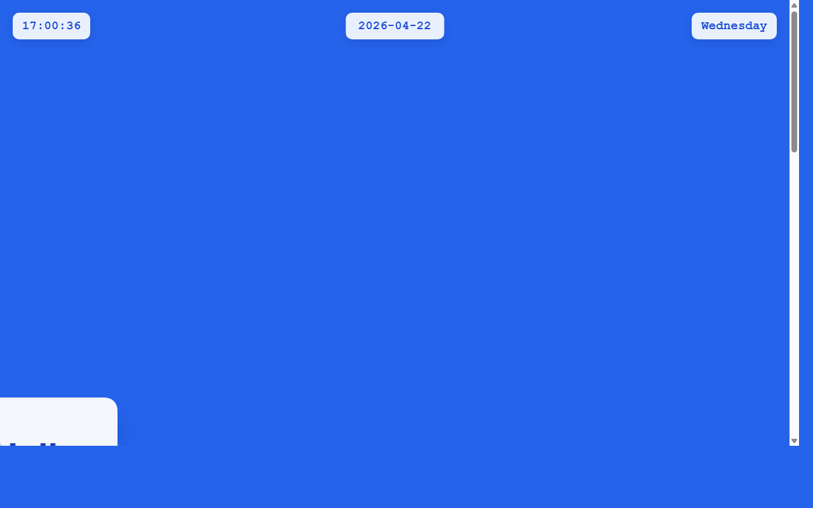

# 产品验收 — 完善全年日历页面布局和样式

## 结果: ❌ 不通过

| 项目 | 值 |
|------|------|
| 评分 | 2/10 (通过线: 6) |
| 状态 | acceptance_rejected |

## 反馈
从截图中可以看到页面显示了一个简单的蓝色背景界面，顶部显示时间、日期和星期信息（17:00:36, 2026-04-22, Wednesday），但完全没有看到需求中要求的2026年12个月网格布局日历展示。页面内容极其简单，与需求描述中的'完善全年日历页面布局和样式'完全不符。

## 检查清单
  1. 入口文件（index.html/main.py）是否存在且可运行
  2. 代码功能是否覆盖需求描述中的所有要点
  3. 代码风格和命名是否规范
  4. 是否有明显的 bug 或安全问题

## 运行效果截图

## 问题
- 截图中完全没有显示12个月的日历网格布局
- 页面只显示了基本的时间日期信息，缺少日历功能的核心展示
- 页面布局过于简单，不符合'完善日历页面布局和样式'的需求
- 没有看到任何月份切换、日期展示等日历应有的功能元素
