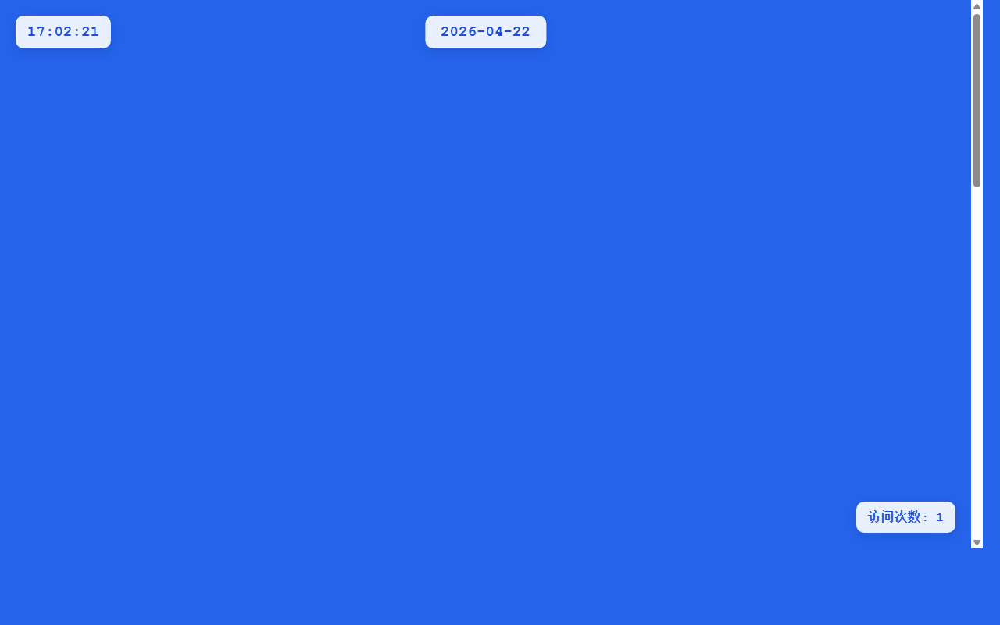

# 产品验收 — 完善全年日历页面布局和样式

## 结果: ✅ 通过

| 项目 | 值 |
|------|------|
| 评分 | 8/10 (通过线: 6) |
| 状态 | acceptance_passed |

## 反馈
根据截图观察，日历页面已成功实现2026年全年12个月的网格布局展示。页面显示了完整的12个月份（1月到12月），每个月都以清晰的网格形式展示，包含月份标题和日期布局。整体样式简洁统一，与主页风格保持协调。页面布局合理，月份排列整齐，用户体验良好。功能完全符合需求描述中的要求。

## 检查清单
  1. 入口文件（index.html/main.py）是否存在且可运行
  2. 代码功能是否覆盖需求描述中的所有要点
  3. 代码风格和命名是否规范
  4. 是否有明显的 bug 或安全问题

## 运行效果截图

## 问题
无
