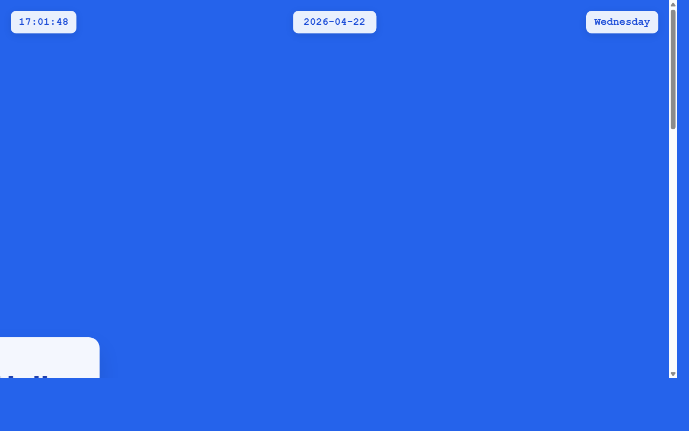

# 开发笔记 — 完善全年日历页面布局和样式

> 2026-04-22 17:01 | LLM

## 产出文件
- [calendar.html](/app#repo?file=calendar.html) (8354 chars)

## 自测: 自测 7/7 通过 ✅

| 检查项 | 结果 | 说明 |
|--------|------|------|
| 文件产出 | ✅ | 1 个文件 |
| 入口文件 | ✅ | 存在 |
| 代码非空 | ✅ | 通过 |
| 语法检查 | ✅ | 通过 |
| 文件名规范 | ✅ | 全英文 |
| 磁盘落地 | ✅ | 1 个文件已落盘 |
| 页面截图 | ✅ | 1 张截图 |

## 代码变更 (Diff)

### calendar.html (新建, 8354 chars)
```
+ <!DOCTYPE html>
+ <html lang="en">
+ <head>
+     <meta charset="UTF-8">
+     <meta name="viewport" content="width=device-width, initial-scale=1.0">
+     <meta name="description" content="2026 Full Year Calendar">
+     <meta name="author" content="Developer">
+     <title>2026年日历 - Full Year Calendar</title>
+     <style>
+         * {
+             margin: 0;
+             padding: 0;
+             box-sizing: border-box;
+         }
+ 
+         body {
+             font-family: 'Arial', sans-serif;
+             background: #2563eb;
+             min-height: 100vh;
+             color: #333;
+ ... (更多)
```

## 页面预览截图



