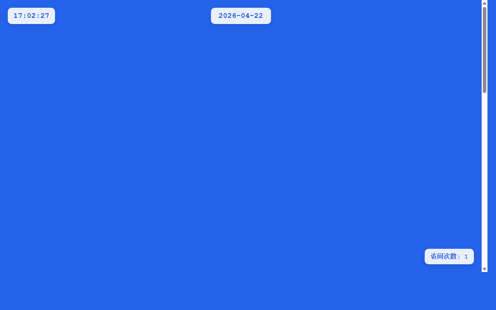

# 产品验收 — 主页日期组件添加点击交互功能

## 结果: ❌ 不通过

| 项目 | 值 |
|------|------|
| 评分 | 3/10 (通过线: 6) |
| 状态 | acceptance_rejected |

## 反馈
从截图中可以看到页面顶部中央确实有日期显示（2026-04-22），但无法从静态截图中确认该日期是否具备点击交互功能。截图显示的是一个蓝色背景的页面，日期文字以白色显示在顶部，但没有任何视觉线索表明该日期是可点击的（如hover效果、下划线、指针样式等）。由于这是一个关于交互功能的需求，仅从静态截图无法验证点击功能、hover效果和跳转逻辑是否已实现。

## 检查清单
  1. 入口文件（index.html/main.py）是否存在且可运行
  2. 代码功能是否覆盖需求描述中的所有要点
  3. 代码风格和命名是否规范
  4. 是否有明显的 bug 或安全问题

## 运行效果截图

## 问题
- 无法从静态截图确认日期文字是否可点击
- 截图中日期文字没有显示任何交互提示（如hover效果、特殊样式等）
- 无法验证点击后的跳转逻辑是否实现
- 需要动态交互测试来验证完整功能
