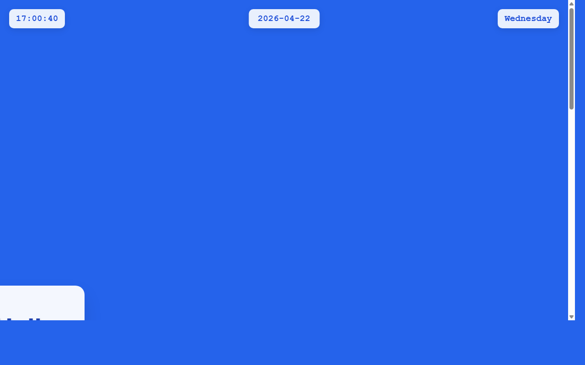

# 产品验收 — 主页日期组件添加点击交互功能

## 结果: ❌ 不通过

| 项目 | 值 |
|------|------|
| 评分 | 3/10 (通过线: 6) |
| 状态 | acceptance_rejected |

## 反馈
从截图中可以看到页面的基本布局，包括顶部的时间显示(17:00:40)、日期显示(2026-04-22)和星期显示(Wednesday)。但是无法从静态截图中确认日期组件是否具备点击交互功能。截图显示的是一个静态状态，无法验证hover效果、点击样式或跳转逻辑是否已实现。需要动态交互测试才能验证这些功能。

## 检查清单
  1. 入口文件（index.html/main.py）是否存在且可运行
  2. 代码功能是否覆盖需求描述中的所有要点
  3. 代码风格和命名是否规范
  4. 是否有明显的 bug 或安全问题

## 运行效果截图

## 问题
- 无法从静态截图验证日期组件的hover效果是否存在
- 无法确认日期文字是否设置为可点击状态
- 无法验证点击样式和跳转逻辑是否已实现
- 需要动态交互测试来验证完整的点击交互功能
