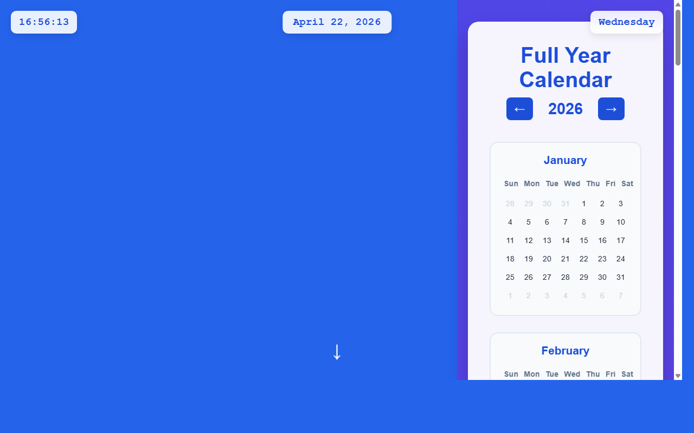

# 产品验收 — 主页日期组件添加点击交互功能

## 结果: ❌ 不通过

| 项目 | 值 |
|------|------|
| 评分 | 3/10 (通过线: 6) |
| 状态 | acceptance_rejected |

## 反馈
从截图中可以看到页面显示了时间（16:56:13）、日期（April 22, 2026）和星期（Wednesday），以及右侧的完整年历。但是无法从静态截图中确认日期文字是否具备可点击状态、hover效果或点击样式。截图显示的是一个静态状态，日期文字看起来就是普通的文本显示，没有明显的交互提示（如下划线、不同颜色、鼠标指针样式等）。需求要求将顶部中央的日期文字设置为可点击状态并添加交互效果，但从当前截图无法验证这些交互功能是否已实现。

## 检查清单
  1. 入口文件（index.html/main.py）是否存在且可运行
  2. 代码功能是否覆盖需求描述中的所有要点
  3. 代码风格和命名是否规范
  4. 是否有明显的 bug 或安全问题

## 运行效果截图

## 问题
- 无法从截图确认日期文字是否可点击
- 截图中日期文字没有显示hover效果或交互样式提示
- 无法验证点击跳转逻辑是否存在
- 日期文字外观与普通文本无异，缺乏交互元素的视觉标识
