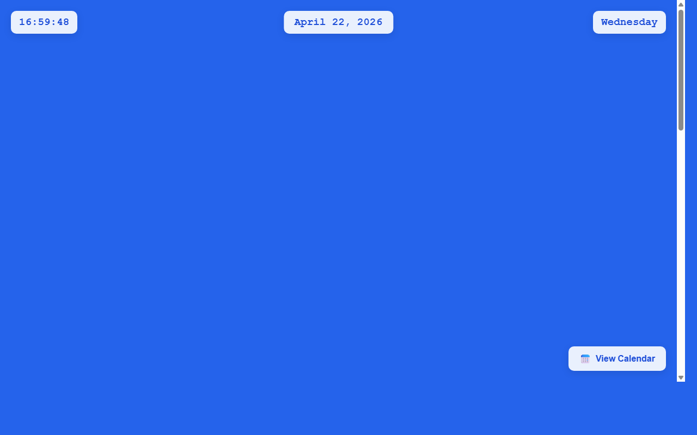

# 开发笔记 — 主页日期组件添加点击交互功能

> 2026-04-22 16:59 | LLM

## 产出文件
- [index.html](/app#repo?file=index.html) (10146 chars)

## 自测: 自测 7/7 通过 ✅

| 检查项 | 结果 | 说明 |
|--------|------|------|
| 文件产出 | ✅ | 1 个文件 |
| 入口文件 | ✅ | 存在 |
| 代码非空 | ✅ | 通过 |
| 语法检查 | ✅ | 通过 |
| 文件名规范 | ✅ | 全英文 |
| 磁盘落地 | ✅ | 1 个文件已落盘 |
| 页面截图 | ✅ | 1 张截图 |

## 代码变更 (Diff)

### index.html (修改)
```diff
--- a/index.html
+++ b/index.html
@@ -43,6 +43,18 @@
             box-shadow: 0 4px 15px rgba(0, 0, 0, 0.1);

             backdrop-filter: blur(10px);

             z-index: 1000;

+            cursor: pointer;

+            transition: all 0.3s ease;

+        }

+

+        .digital-clock:hover {

+            background: rgba(255, 255, 255, 1);

+            transform: translateY(-2px);

+            box-shadow: 0 6px 20px rgba(0, 0, 0, 0.15);

+        }

+

+        .digital-clock:active {

+            transform: translateY(0);

         }

 

         .date-display {

@@ -60,6 +72,18 @@
             box-shadow: 0 4px 15px rgba(0, 0, 0, 0.1);

             backdrop-filter: blur(10px);

             z-index: 1000;

+            cursor: pointer;

+            transition: all 0.3s ease;

+        }

+

+        .date-display:hover {

+            background: rgba(255, 255, 255, 1);

+            transform: translateX(-50%) translateY(-2px);

+            box-shadow: 0 6px 20px rgba(0, 0, 0, 0.15);

+        }

+

+        .date-display:active {

+            transform: translateX(-50%) translateY(0);

         }

 

         .weekday-display {

@@ -76,6 +100,18 @@
             box-shadow: 0 4px 15px rgba(0, 0, 0, 0.1);

             backdrop-filter: blur(10px);

             z-index: 1000;

+            cursor: pointer;

+            transition: all 0.3s ease;

+        }

+

+        .weekday-display:hover {

+            background: rgba(255, 255, 255, 1);

... (共 79 行变更)
```

## 页面预览截图



