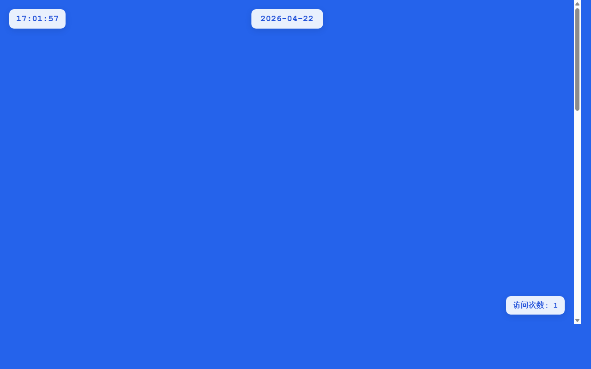

# 开发笔记 — 主页日期组件添加点击交互功能

> 2026-04-22 17:01 | LLM

## 产出文件
- [index.html](/app#repo?file=index.html) (7422 chars)

## 自测: 自测 7/7 通过 ✅

| 检查项 | 结果 | 说明 |
|--------|------|------|
| 文件产出 | ✅ | 1 个文件 |
| 入口文件 | ✅ | 存在 |
| 代码非空 | ✅ | 通过 |
| 语法检查 | ✅ | 通过 |
| 文件名规范 | ✅ | 全英文 |
| 磁盘落地 | ✅ | 1 个文件已落盘 |
| 页面截图 | ✅ | 1 张截图 |

## 代码变更 (Diff)

### index.html (修改)
```diff
--- a/index.html
+++ b/index.html
@@ -77,15 +77,40 @@
             box-shadow: 0 2px 10px rgba(0, 0, 0, 0.15);

         }

 

-        .weekday-display {

+        .hello-world {

+            text-align: center;

+            background: rgba(255, 255, 255, 0.95);

+            padding: 40px;

+            border-radius: 20px;

+            box-shadow: 0 10px 30px rgba(0, 0, 0, 0.2);

+            backdrop-filter: blur(15px);

+            max-width: 600px;

+            margin: 0 20px;

+        }

+

+        .hello-world h1 {

+            font-size: 3rem;

+            margin-bottom: 20px;

+            color: #1d4ed8;

+            text-shadow: 2px 2px 4px rgba(0, 0, 0, 0.1);

+        }

+

+        .hello-world p {

+            font-size: 1.2rem;

+            line-height: 1.6;

+            color: #4b5563;

+            margin-bottom: 15px;

+        }

+

+        .visit-counter {

             position: fixed;

-            top: 20px;

+            bottom: 20px;

             right: 20px;

             background: rgba(255, 255, 255, 0.9);

             padding: 10px 15px;

             border-radius: 10px;

             font-family: 'Courier New', monospace;

-            font-size: 1.2rem;

+            font-size: 1rem;

             font-weight: bold;

             color: #1d4ed8;

             box-shadow: 0 4px 15px rgba(0, 0, 0, 0.1);

@@ -93,240 +118,114 @@
             z-index: 1000;

         }

 

... (共 368 行变更)
```

## 页面预览截图



