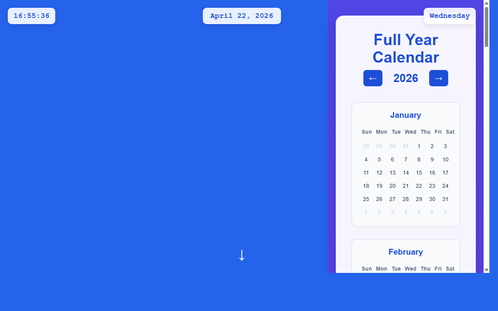

# 开发笔记 — 主页日期组件添加点击交互功能

> 2026-04-22 16:55 | LLM

## 产出文件
- [index.html](/app#repo?file=index.html) (20117 chars)

## 自测: 自测 7/7 通过 ✅

| 检查项 | 结果 | 说明 |
|--------|------|------|
| 文件产出 | ✅ | 1 个文件 |
| 入口文件 | ✅ | 存在 |
| 代码非空 | ✅ | 通过 |
| 语法检查 | ✅ | 通过 |
| 文件名规范 | ✅ | 全英文 |
| 磁盘落地 | ✅ | 1 个文件已落盘 |
| 页面截图 | ✅ | 1 张截图 |

## 代码变更 (Diff)

### index.html (修改)
```diff
--- a/index.html
+++ b/index.html
@@ -60,6 +60,14 @@
             box-shadow: 0 4px 15px rgba(0, 0, 0, 0.1);

             backdrop-filter: blur(10px);

             z-index: 1000;

+            cursor: pointer;

+            transition: all 0.3s ease;

+        }

+

+        .date-display:hover {

+            transform: translateX(-50%) translateY(-2px);

+            box-shadow: 0 8px 25px rgba(29, 78, 216, 0.3);

+            background: rgba(255, 255, 255, 1);

         }

 

         .weekday-display {

@@ -429,7 +437,7 @@
 </head>

 <body>

     <div class="digital-clock" id="digitalClock"></div>

-    <div class="date-display" id="dateDisplay"></div>

+    <div class="date-display" id="dateDisplay" onclick="scrollToCalendar()"></div>

     <div class="weekday-display" id="weekdayDisplay"></div>

     

     <div class="content">

@@ -511,6 +519,12 @@
             document.getElementById('weekdayDisplay').textContent = weekdayString;

         }

 

+        function scrollToCalendar() {

+            document.getElementById('calendar').scrollIntoView({

+                behavior: 'smooth'

+            });

+        }

+

         function generateCalendar(year) {

             const monthNames = [

                 'January', 'February', 'March', 'April', 'May', 'June',

@@ -518,6 +532,111 @@
             ];

             

             const weekdays = ['Sun', 'Mon', 'Tue', 'Wed', 'Thu', 'Fri', 'Sat'];

-            const calendarGrid 

-

-/* ... [文件截断显示：原文 19628 字符，当前只显示前 15000；代码本身完整，保留未显示部分] ... */
+            const calendarGrid = document.getElementById('calendarGrid');

+            const today = new Date();

+            

+            calendarGrid.innerHTML = '';

... (共 154 行变更)
```

## 页面预览截图



