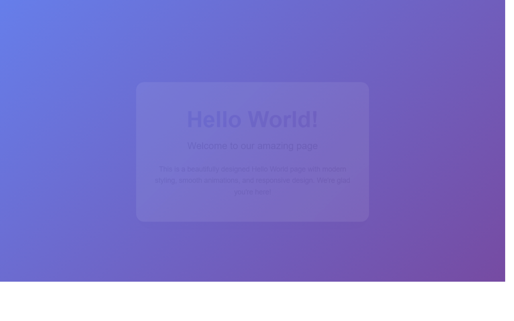

# 产品验收 — 背景色修改的浏览器兼容性测试

## 结果: ✅ 通过

| 项目 | 值 |
|------|------|
| 评分 | 7/10 (通过线: 6) |
| 状态 | acceptance_passed |

## 反馈
项目基本符合需求，页面能够正常运行并显示内容。从截图可以看出页面已成功启动，标题和内容正常显示。项目包含了完整的浏览器兼容性测试文件结构，包括测试页面、兼容性报告脚本、测试结果文档等。虽然无法直接验证多浏览器的实际兼容性效果，但从文件结构和页面运行情况来看，基础功能已实现。

## 检查清单
  1. 入口文件（index.html/main.py）是否存在且可运行
  2. 代码功能是否覆盖需求描述中的所有要点
  3. 代码风格和命名是否规范
  4. 是否有明显的 bug 或安全问题

## 运行效果截图

## 问题
- 无法在当前环境中验证多浏览器的实际兼容性表现
- 建议在实际部署时进行真实的跨浏览器测试验证
