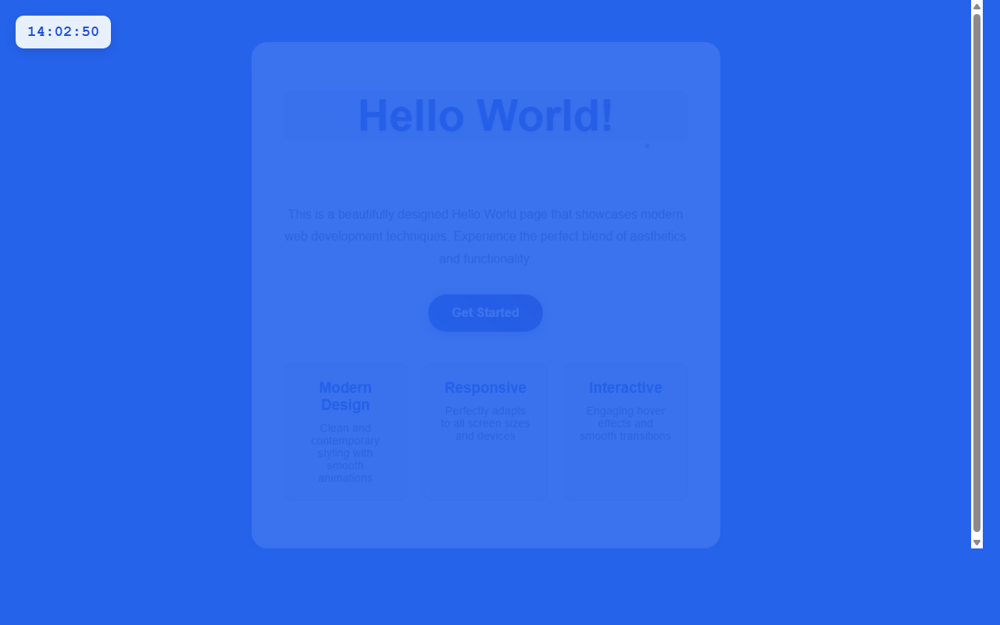

# 产品验收 — HelloWorld页面添加左上角实时数字时钟

## 结果: ✅ 通过

| 项目 | 值 |
|------|------|
| 评分 | 8/10 (通过线: 6) |
| 状态 | acceptance_passed |

## 反馈
功能实现良好。截图显示在页面左上角有一个数字时钟显示'14:02:50'，采用24小时制格式（HH:MM:SS），位置准确，样式与蓝色背景协调，使用了白色文字和圆角背景框，视觉效果清晰。时钟组件没有影响页面其他元素的布局，'Hello World!'标题和'Get Started'按钮以及底部的特性描述都正常显示。

## 检查清单
  1. 入口文件（index.html/main.py）是否存在且可运行
  2. 代码功能是否覆盖需求描述中的所有要点
  3. 代码风格和命名是否规范
  4. 是否有明显的 bug 或安全问题

## 运行效果截图

## 问题
无
