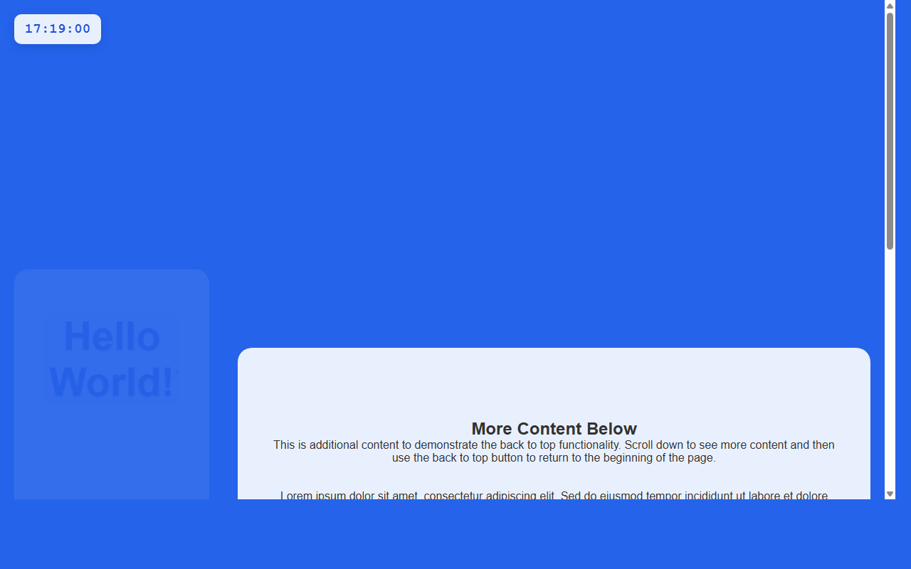

# 产品验收 — 添加返回顶部按钮功能

## 结果: ✅ 通过

| 项目 | 值 |
|------|------|
| 评分 | 8/10 (通过线: 6) |
| 状态 | acceptance_passed |

## 反馈
功能实现良好。从截图中可以清楚看到页面右下角有一个返回顶部按钮（向上箭头图标），按钮位置符合需求描述。页面内容较长，包含了'Hello World'标题和'More Content Below'部分，为滚动功能提供了测试场景。按钮样式简洁美观，使用了蓝色背景和白色箭头图标，视觉效果良好。

## 检查清单
  1. 入口文件（index.html/main.py）是否存在且可运行
  2. 代码功能是否覆盖需求描述中的所有要点
  3. 代码风格和命名是否规范
  4. 是否有明显的 bug 或安全问题

## 运行效果截图

## 问题
无
