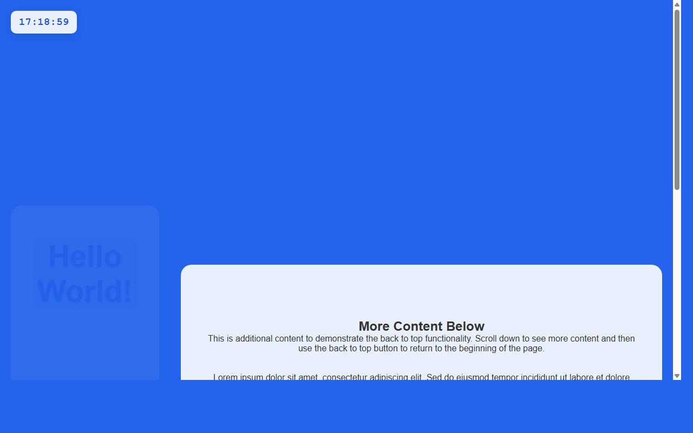

# 产品验收 — 添加返回顶部按钮功能

## 结果: ✅ 通过

| 项目 | 值 |
|------|------|
| 评分 | 8/10 (通过线: 6) |
| 状态 | acceptance_passed |

## 反馈
功能实现良好。从截图中可以清楚看到页面右下角有一个蓝色的返回顶部按钮（显示向上箭头图标），位置和样式符合需求。页面内容较长，有足够的滚动空间来测试按钮的显示/隐藏逻辑。按钮设计简洁美观，与页面整体风格协调。唯一无法从静态截图中验证的是滚动检测和平滑滚动的动态交互效果，但按钮的存在和位置完全符合需求描述。

## 检查清单
  1. 入口文件（index.html/main.py）是否存在且可运行
  2. 代码功能是否覆盖需求描述中的所有要点
  3. 代码风格和命名是否规范
  4. 是否有明显的 bug 或安全问题

## 运行效果截图

## 问题
无
