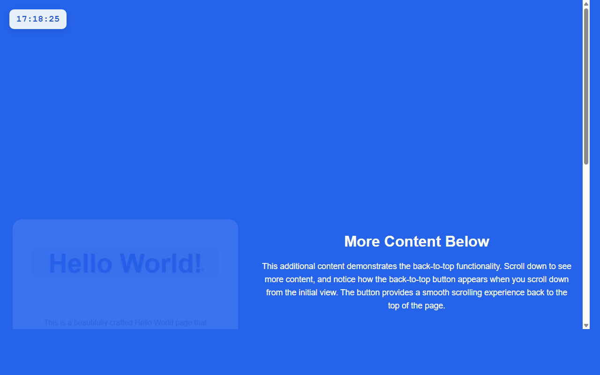

# 开发笔记 — 添加返回顶部按钮功能

> 2026-04-21 17:18 | LLM

## 产出文件
- [index.html](/app#repo?file=index.html) (7775 chars)

## 自测: 自测 6/6 通过 ✅

| 检查项 | 结果 | 说明 |
|--------|------|------|
| 文件产出 | ✅ | 1 个文件 |
| 入口文件 | ✅ | 存在 |
| 代码非空 | ✅ | 通过 |
| 语法检查 | ✅ | 通过 |
| 文件名规范 | ✅ | 全英文 |
| 页面截图 | ✅ | 1 张截图 |

## 代码变更 (Diff)

### index.html (修改)
```diff
--- a/index.html
+++ b/index.html
@@ -17,12 +17,16 @@
         body {

             font-family: 'Arial', sans-serif;

             background: #2563eb;

+            min-height: 200vh;

+            color: #333;

+            position: relative;

+        }

+

+        .content-wrapper {

             min-height: 100vh;

             display: flex;

             align-items: center;

             justify-content: center;

-            color: #333;

-            position: relative;

         }

 

         .digital-clock {

@@ -103,5 +107,146 @@
 

         .cta-button {

             display: inline-block;

-            padding: 

-... (truncated, 7625 chars)
+            padding: 15px 30px;

+            background: linear-gradient(45deg, #1d4ed8, #3730a3);

+            color: white;

+            text-decoration: none;

+            border-radius: 50px;

+            font-weight: bold;

+            font-size: 1.1rem;

+            transition: all 0.3s ease;

+            box-shadow: 0 4px 15px rgba(29, 78, 216, 0.4);

+            text-shadow: 0 1px 2px rgba(0, 0, 0, 0.1);

+        }

+

+        .cta-button:hover {

+            transform: translateY(-2px);

+            box-shadow: 0 8px 25px rgba(29, 78, 216, 0.6);

+        }

+

+        .back-to-top {

+            position: fixed;

+            bottom: 30px;

+            right: 30px;

+            width: 50px;

+            height: 50px;

... (共 170 行变更)
```

## 页面预览截图



