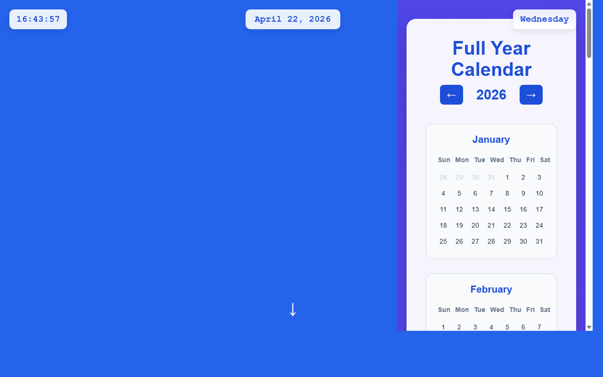

# 产品验收 — 实现日期点击交互和页面跳转逻辑

## 结果: ❌ 不通过

| 项目 | 值 |
|------|------|
| 评分 | 3/10 (通过线: 6) |
| 状态 | acceptance_rejected |

## 反馈
从截图中可以看到一个完整的日历界面，显示了2026年的全年日历视图，包含January和February两个月份。但是根据需求描述，应该实现的是「为顶部日期显示区域添加点击事件监听器，实现页面跳转到全年日历视图的交互逻辑」。截图中显示的是已经在全年日历视图中，而不是从某个日期显示区域点击后跳转到这个视图的状态。无法从当前截图中确认是否存在可点击的顶部日期显示区域，也无法验证点击交互和页面跳转功能是否已实现。需要看到初始页面状态和点击交互的演示才能验收此功能。

## 检查清单
  1. 入口文件（index.html/main.py）是否存在且可运行
  2. 代码功能是否覆盖需求描述中的所有要点
  3. 代码风格和命名是否规范
  4. 是否有明显的 bug 或安全问题

## 运行效果截图

## 问题
- 截图显示的是全年日历视图的最终状态，无法验证点击交互功能
- 缺少初始页面状态，无法确认顶部日期显示区域的存在
- 无法验证点击事件监听器是否已添加
- 无法确认页面跳转逻辑是否正常工作
