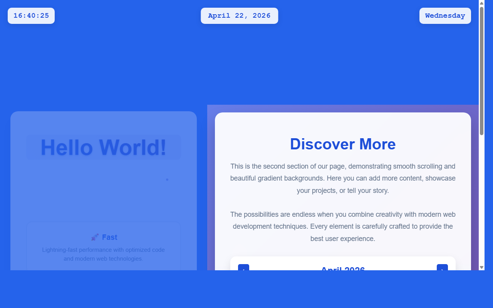

# 产品验收 — 实现日期点击交互和页面跳转逻辑

## 结果: ❌ 不通过

| 项目 | 值 |
|------|------|
| 评分 | 3/10 (通过线: 6) |
| 状态 | acceptance_rejected |

## 反馈
从截图中可以看到一个蓝色渐变背景的页面，显示了时间(16:40:25)、日期(April 22, 2026)和星期(Wednesday)。页面左侧有'Hello World!'标题和'Fast'特性描述，右侧有'Discover More'内容区域。但是，截图中无法验证日期点击交互功能是否已实现。需求要求为顶部日期显示区域添加点击事件监听器，实现页面跳转到全年日历视图的交互逻辑。由于这是一个交互功能，仅从静态截图无法确认点击事件是否已添加，也看不到点击后是否会跳转到全年日历视图。需要提供点击交互的演示或相关功能的可视化证据。

## 检查清单
  1. 入口文件（index.html/main.py）是否存在且可运行
  2. 代码功能是否覆盖需求描述中的所有要点
  3. 代码风格和命名是否规范
  4. 是否有明显的 bug 或安全问题

## 运行效果截图

## 问题
- 无法从静态截图验证日期点击交互功能是否实现
- 缺少全年日历视图的相关UI元素或跳转提示
- 需要交互演示或动态截图来验证点击事件监听器的实现
