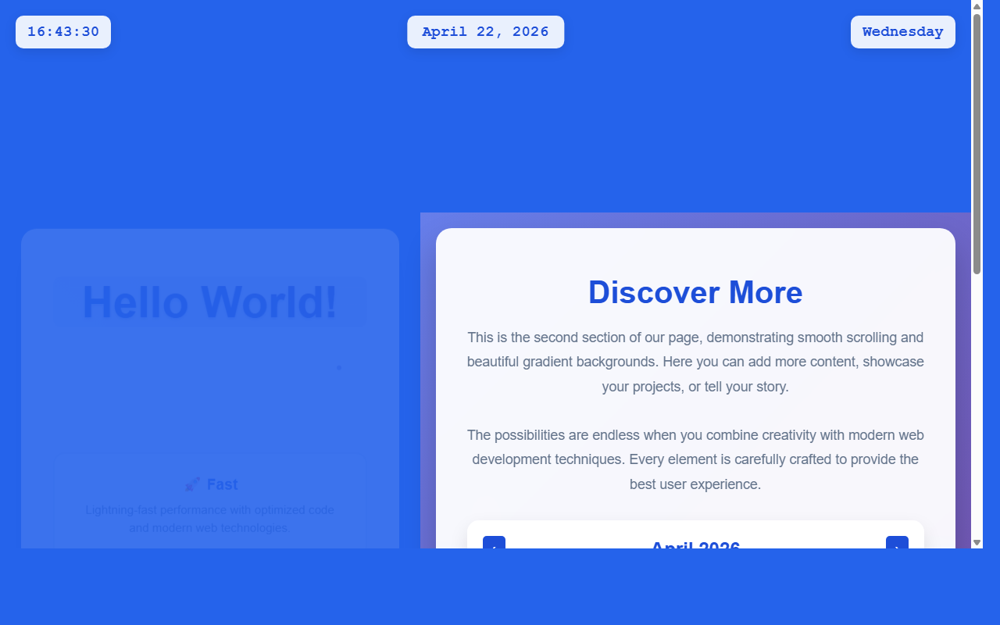

# 开发笔记 — 实现日期点击交互和页面跳转逻辑

> 2026-04-22 16:43 | LLM

## 产出文件
- [calendar.html](/app#repo?file=calendar.html) (15890 chars)
- [calendar.css](/app#repo?file=calendar.css) (6408 chars)
- [calendar.js](/app#repo?file=calendar.js) (14925 chars)
- [index.html](/app#repo?file=index.html) (18857 chars)

## 自测: 自测 7/7 通过 ✅

| 检查项 | 结果 | 说明 |
|--------|------|------|
| 文件产出 | ✅ | 4 个文件 |
| 入口文件 | ✅ | 存在 |
| 代码非空 | ✅ | 通过 |
| 语法检查 | ✅ | 通过 |
| 文件名规范 | ✅ | 全英文 |
| 磁盘落地 | ✅ | 4 个文件已落盘 |
| 页面截图 | ✅ | 1 张截图 |

## 代码变更 (Diff)

### calendar.html (新建, 15890 chars)
```
+ <!DOCTYPE html>
+ <html lang="en">
+ <head>
+     <meta charset="UTF-8">
+     <meta name="viewport" content="width=device-width, initial-scale=1.0">
+     <meta name="description" content="Full Year Calendar View">
+     <meta name="author" content="Developer">
+     <title>Calendar - Full Year View</title>
+     <style>
+         * {
+             margin: 0;
+             padding: 0;
+             box-sizing: border-box;
+         }
+ 
+         body {
+             font-family: 'Arial', sans-serif;
+             background: linear-gradient(135deg, #667eea 0%, #764ba2 100%);
+             min-height: 100vh;
+             color: #333;
+ ... (更多)
```

### calendar.css (新建, 6408 chars)
```
+ * {
+     margin: 0;
+     padding: 0;
+     box-sizing: border-box;
+ }
+ 
+ body {
+     font-family: 'Arial', sans-serif;
+     background: linear-gradient(135deg, #667eea 0%, #764ba2 100%);
+     min-height: 100vh;
+     color: #333;
+     position: relative;
+ }
+ 
+ .calendar-page {
+     padding: 20px;
+     max-width: 1200px;
+     margin: 0 auto;
+ }
+ 
+ ... (更多)
```

### calendar.js (新建, 14925 chars)
```
+ // calendar.js - 日期点击交互和页面跳转逻辑
+ 
+ // 等待DOM加载完成
+ document.addEventListener('DOMContentLoaded', function() {
+     // 获取日期显示元素
+     const dateDisplay = document.querySelector('.date-display');
+     
+     // 为日期显示区域添加点击事件监听器
+     if (dateDisplay) {
+         // 添加鼠标悬停效果样式
+         dateDisplay.style.cursor = 'pointer';
+         dateDisplay.style.transition = 'all 0.3s ease';
+         
+         // 鼠标悬停效果
+         dateDisplay.addEventListener('mouseenter', function() {
+             this.style.transform = 'translateX(-50%) scale(1.05)';
+             this.style.boxShadow = '0 6px 20px rgba(29, 78, 216, 0.3)';
+             this.style.background = 'rgba(29, 78, 216, 0.1)';
+         });
+         
+ ... (更多)
```

### index.html (修改)
```diff
--- a/index.html
+++ b/index.html
@@ -60,6 +60,14 @@
             box-shadow: 0 4px 15px rgba(0, 0, 0, 0.1);

             backdrop-filter: blur(10px);

             z-index: 1000;

+            cursor: pointer;

+            transition: all 0.3s ease;

+        }

+

+        .date-display:hover {

+            background: rgba(255, 255, 255, 1);

+            transform: translateX(-50%) translateY(-2px);

+            box-shadow: 0 6px 20px rgba(0, 0, 0, 0.15);

         }

 

         .weekday-display {

@@ -317,6 +325,15 @@
         }

 

         .calendar-day.today:hover {

+            background: #3730a3;

+        }

+

+        .calendar-day.clickable:hover {

+            background: #e2e8f0;

+            transform: scale(1.05);

+        }

+

+        .calendar-day.clickable.today:hover {

             background: #3730a3;

         }

 

@@ -484,6 +501,84 @@
             // Add days of the current month

             for (let day = 1; day <= daysInMonth; day++) {

                 const dayElement = document.createElement('div');

-                dayElement.className = 

-

-/* ... [文件截断显示：原文 17656 字符，当前只显示前 15000；代码本身完整，保留未显示部分] ... */
+                dayElement.className = 'calendar-day clickable';

+                dayElement.textContent = day;

+                

+                // Check if this is today

+                if (year === today.getFullYear() && 

+                    month === today.getMonth() && 

+                    day === today.getDate()) {

+                    dayElement.classList.add('today');

+                }

+                

... (共 121 行变更)
```

## 页面预览截图



