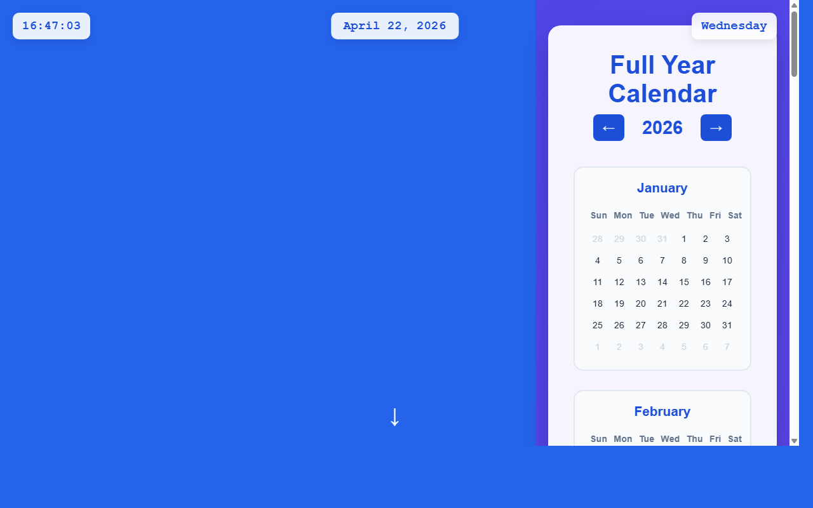

# 开发笔记 — 实现日期点击交互和页面跳转逻辑

> 2026-04-22 16:47 | LLM

## 产出文件
- [index.html](/app#repo?file=index.html) (20302 chars)

## 自测: 自测 7/7 通过 ✅

| 检查项 | 结果 | 说明 |
|--------|------|------|
| 文件产出 | ✅ | 1 个文件 |
| 入口文件 | ✅ | 存在 |
| 代码非空 | ✅ | 通过 |
| 语法检查 | ✅ | 通过 |
| 文件名规范 | ✅ | 全英文 |
| 磁盘落地 | ✅ | 1 个文件已落盘 |
| 页面截图 | ✅ | 1 张截图 |

## 代码变更 (Diff)

### index.html (修改)
```diff
--- a/index.html
+++ b/index.html
@@ -379,6 +379,12 @@
             color: #1e293b;

         }

 

+        .day.selected {

+            background: #10b981;

+            color: white;

+            font-weight: bold;

+        }

+

         @media (max-width: 768px) {

             .hello-world {

                 font-size: 2.5rem;

@@ -491,6 +497,7 @@
 

     <script>

         let currentCalendarYear = new Date().getFullYear();

+        let selectedDate = null;

 

         function updateDateTime() {

             const now = new Date();

@@ -520,6 +527,128 @@
         }

 

         function scrollToCalendar() {

-            document.getEleme

-

-/* ... [文件截断显示：原文 19063 字符，当前只显示前 15000；代码本身完整，保留未显示部分] ... */
+            document.getElementById('calendar').scrollIntoView({ 

+                behavior: 'smooth' 

+            });

+        }

+

+        function changeYear(delta) {

+            currentCalendarYear += delta;

+            generateCalendar();

+        }

+

+        function generateCalendar() {

+            const calendarGrid = document.getElementById('calendarGrid');

+            const currentYearSpan = document.getElementById('currentYear');

+            

+            currentYearSpan.textContent = currentCalendarYear;

+            calendarGrid.innerHTML = '';

+

+            const monthNames = [

+                'January', 'February', 'March', 'April', 'May', 'June',

+                'July', 'August', 'September', 'October', 'November', 'December'

... (共 155 行变更)
```

## 页面预览截图



