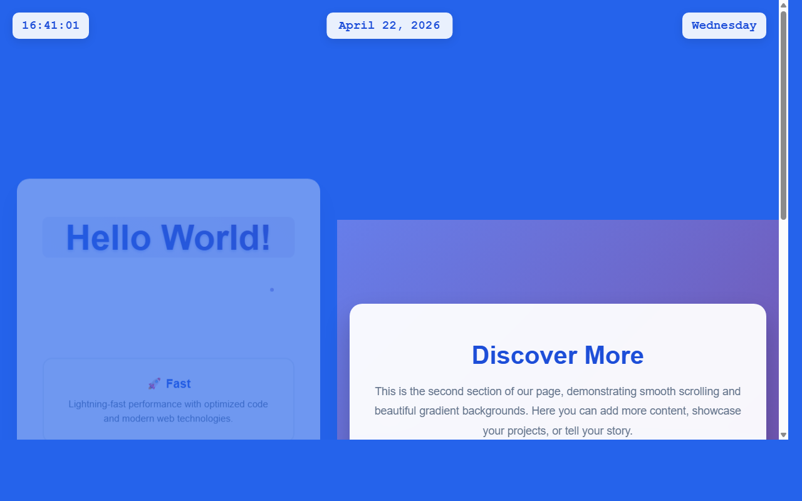

# 开发笔记 — 实现日期点击交互和页面跳转逻辑

> 2026-04-22 16:41 | LLM

## 产出文件
- [calendar.html](/app#repo?file=calendar.html) (14653 chars)
- [calendar.css](/app#repo?file=calendar.css) (7010 chars)
- [calendar.js](/app#repo?file=calendar.js) (21153 chars)
- [index.html](/app#repo?file=index.html) (11998 chars)

## 自测: 自测 7/7 通过 ✅

| 检查项 | 结果 | 说明 |
|--------|------|------|
| 文件产出 | ✅ | 4 个文件 |
| 入口文件 | ✅ | 存在 |
| 代码非空 | ✅ | 通过 |
| 语法检查 | ✅ | 通过 |
| 文件名规范 | ✅ | 全英文 |
| 磁盘落地 | ✅ | 4 个文件已落盘 |
| 页面截图 | ✅ | 1 张截图 |

## 代码变更 (Diff)

### calendar.html (新建, 14653 chars)
```
+ <!DOCTYPE html>
+ <html lang="en">
+ <head>
+     <meta charset="UTF-8">
+     <meta name="viewport" content="width=device-width, initial-scale=1.0">
+     <meta name="description" content="Full Year Calendar View">
+     <meta name="author" content="Developer">
+     <title>Calendar - Full Year View</title>
+     <link rel="stylesheet" href="styles.css">
+     <style>
+         * {
+             margin: 0;
+             padding: 0;
+             box-sizing: border-box;
+         }
+ 
+         body {
+             font-family: 'Arial', sans-serif;
+             background: #2563eb;
+             min-height: 100vh;
+ ... (更多)
```

### calendar.css (新建, 7010 chars)
```
+ * {
+     margin: 0;
+     padding: 0;
+     box-sizing: border-box;
+ }
+ 
+ body {
+     font-family: 'Arial', sans-serif;
+     background: linear-gradient(135deg, #667eea 0%, #764ba2 100%);
+     min-height: 100vh;
+     color: #333;
+     position: relative;
+ }
+ 
+ .digital-clock {
+     position: fixed;
+     top: 20px;
+     left: 20px;
+     background: rgba(255, 255, 255, 0.9);
+     padding: 10px 15px;
+ ... (更多)
```

### calendar.js (新建, 21153 chars)
```
+ // calendar.js - 日期点击交互和页面跳转逻辑
+ 
+ class CalendarManager {
+     constructor() {
+         this.currentDate = new Date();
+         this.init();
+     }
+ 
+     init() {
+         this.setupDateClickHandlers();
+         this.createCalendarModal();
+         this.setupKeyboardShortcuts();
+     }
+ 
+     // 为顶部日期显示区域添加点击事件监听器
+     setupDateClickHandlers() {
+         const dateDisplay = document.getElementById('dateDisplay');
+         const weekdayDisplay = document.getElementById('weekdayDisplay');
+         
+         if (dateDisplay) {
+ ... (更多)
```

### index.html (修改)
```diff
--- a/index.html
+++ b/index.html
@@ -60,6 +60,14 @@
             box-shadow: 0 4px 15px rgba(0, 0, 0, 0.1);

             backdrop-filter: blur(10px);

             z-index: 1000;

+            cursor: pointer;

+            transition: all 0.3s ease;

+        }

+

+        .date-display:hover {

+            background: rgba(255, 255, 255, 1);

+            transform: translateX(-50%) scale(1.05);

+            box-shadow: 0 6px 20px rgba(0, 0, 0, 0.15);

         }

 

         .weekday-display {

@@ -340,6 +348,17 @@
         updateDateTime();

         setInterval(updateDateTime, 1000);

 

+        // Date click handler

+        document.getElementById('dateDisplay').addEventListener('click', function() {

+            const now = new Date();

+            const year = now.getFullYear();

+            const month = String(now.getMonth() + 1).padStart(2, '0');

+            const day = String(now.getDate()).padStart(2, '0');

+            const dateParam = `${year}-${month}-${day}`;

+            

+            window.location.href = `calendar.html?date=${dateParam}`;

+        });

+

         // Smooth scrolling for anchor links

         document.querySelectorAll('a[href^="#"]').forEach(anchor => {

             anchor.addEventListener('click', function (e) {

```

## 页面预览截图



