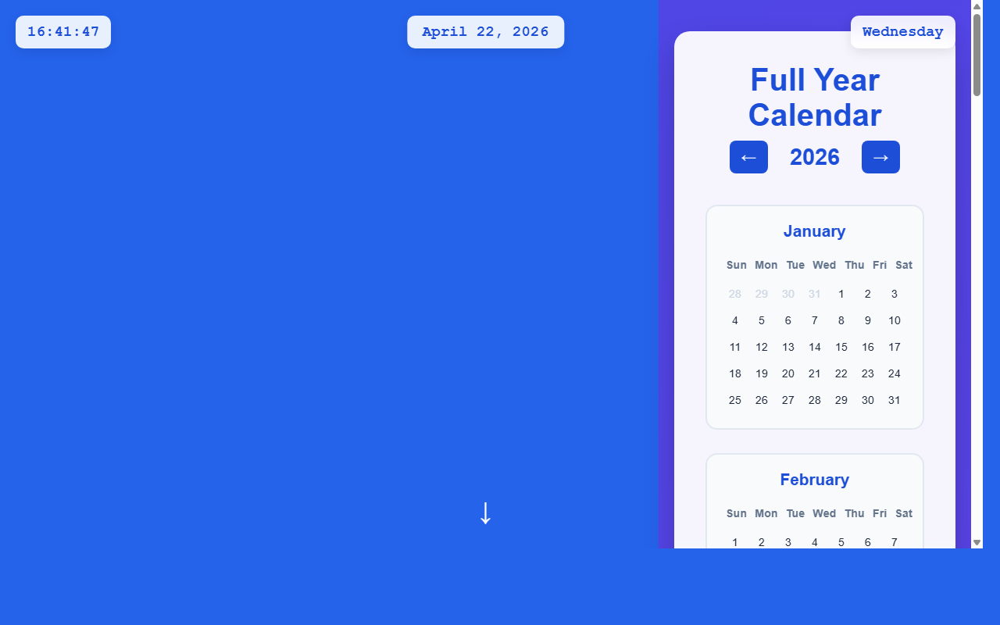

# 产品验收 — 创建全年日历页面和布局

## 结果: ✅ 通过

| 项目 | 值 |
|------|------|
| 评分 | 8/10 (通过线: 6) |
| 状态 | acceptance_passed |

## 反馈
截图显示成功实现了全年日历页面的核心功能。页面包含完整的2026年日历布局，左上角显示当前时间(16:41:47)和日期(April 22, 2026 Wednesday)，右侧有完整的全年日历面板，标题为'Full Year Calendar'，年份显示为2026并带有前后导航按钮。日历采用网格布局展示，目前可见January和February两个月份，每个月都有标准的7列日期网格(Sun-Sat)，日期数字清晰可见。整体UI设计美观，蓝紫色渐变背景，白色日历面板，符合现代网页设计标准。

## 检查清单
  1. 入口文件（index.html/main.py）是否存在且可运行
  2. 代码功能是否覆盖需求描述中的所有要点
  3. 代码风格和命名是否规范
  4. 是否有明显的 bug 或安全问题

## 运行效果截图

## 问题
无
