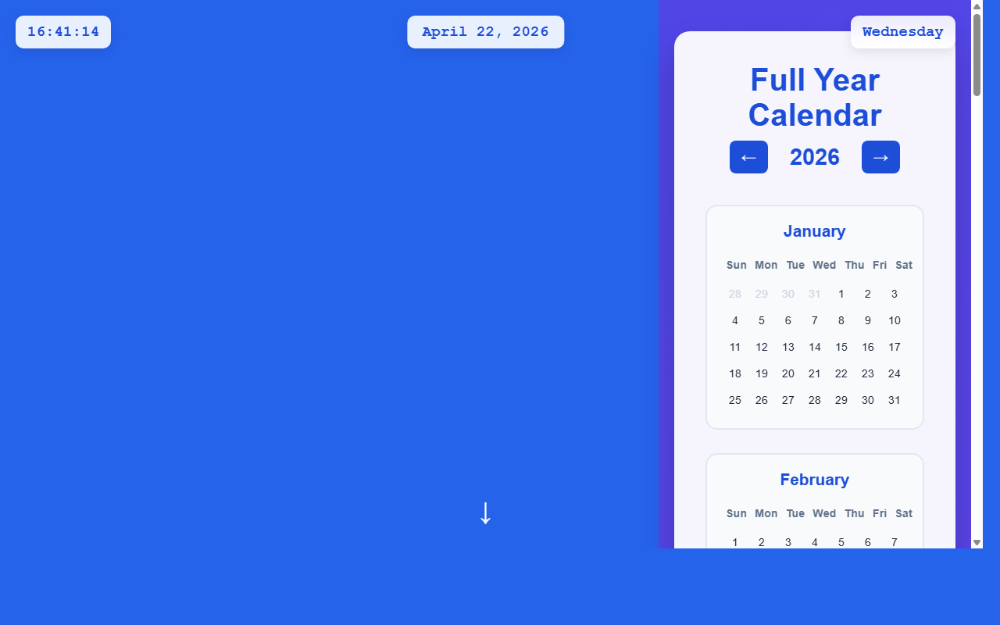

# 开发笔记 — 创建全年日历页面和布局

> 2026-04-22 16:41 | LLM

## 产出文件
- [calendar.html](/app#repo?file=calendar.html) (14113 chars)
- [calendar.css](/app#repo?file=calendar.css) (6480 chars)
- [calendar.js](/app#repo?file=calendar.js) (14918 chars)
- [index.html](/app#repo?file=index.html) (19628 chars)

## 自测: 自测 7/7 通过 ✅

| 检查项 | 结果 | 说明 |
|--------|------|------|
| 文件产出 | ✅ | 4 个文件 |
| 入口文件 | ✅ | 存在 |
| 代码非空 | ✅ | 通过 |
| 语法检查 | ✅ | 通过 |
| 文件名规范 | ✅ | 全英文 |
| 磁盘落地 | ✅ | 4 个文件已落盘 |
| 页面截图 | ✅ | 1 张截图 |

## 代码变更 (Diff)

### calendar.html (新建, 14113 chars)
```
+ <!DOCTYPE html>
+ <html lang="en">
+ <head>
+     <meta charset="UTF-8">
+     <meta name="viewport" content="width=device-width, initial-scale=1.0">
+     <meta name="description" content="Full Year Calendar - 12 Month View">
+     <meta name="author" content="Developer">
+     <title>Calendar - Full Year View</title>
+     <style>
+         * {
+             margin: 0;
+             padding: 0;
+             box-sizing: border-box;
+         }
+ 
+         body {
+             font-family: 'Arial', sans-serif;
+             background: #2563eb;
+             min-height: 100vh;
+             color: #333;
+ ... (更多)
```

### calendar.css (新建, 6480 chars)
```
+ * {
+     margin: 0;
+     padding: 0;
+     box-sizing: border-box;
+ }
+ 
+ body {
+     font-family: 'Arial', sans-serif;
+     background: #2563eb;
+     min-height: 100vh;
+     color: #333;
+     position: relative;
+ }
+ 
+ .digital-clock {
+     position: fixed;
+     top: 20px;
+     left: 20px;
+     background: rgba(255, 255, 255, 0.9);
+     padding: 10px 15px;
+ ... (更多)
```

### calendar.js (新建, 14918 chars)
```
+ <!DOCTYPE html>
+ <html lang="en">
+ <head>
+     <meta charset="UTF-8">
+     <meta name="viewport" content="width=device-width, initial-scale=1.0">
+     <meta name="description" content="Full Year Calendar - 12 Month View">
+     <meta name="author" content="Developer">
+     <title>Calendar - Full Year View</title>
+     <style>
+         * {
+             margin: 0;
+             padding: 0;
+             box-sizing: border-box;
+         }
+ 
+         body {
+             font-family: 'Arial', sans-serif;
+             background: #2563eb;
+             min-height: 100vh;
+             color: #333;
+ ... (更多)
```

### index.html (修改)
```diff
--- a/index.html
+++ b/index.html
@@ -17,7 +17,7 @@
         body {

             font-family: 'Arial', sans-serif;

             background: #2563eb;

-            min-height: 200vh;

+            min-height: 300vh;

             color: #333;

             position: relative;

         }

@@ -234,6 +234,143 @@
             margin-bottom: 30px;

         }

 

+        .calendar-section {

+            min-height: 100vh;

+            display: flex;

+            align-items: center;

+            justify-content: center;

+            background: linear-gradient(135deg, #4f46e5 0%, #7c3aed 100%);

+            padding: 40px 20px;

+        }

+

+        .calendar-container {

+            background: rgba(255, 255, 255, 0.95);

+            padding: 40px;

+            border-radius: 20px;

+            box-shadow: 0 20px 40px rgba(0, 0, 0, 0.2);

+            max-width: 1200px;

+            width: 100%;

+            backdrop-filter: blur(10px);

+        }

+

+        .calendar-header {

+            text-align: center;

+            margin-bottom: 40px;

+        }

+

+        .calendar-header h2 {

+            font-size: 2.5rem;

+            color: #1d4ed8;

+            margin-bottom: 10px;

+        }

+

+        .year-selector {

+            display: flex;

+            align-items: center;

+            justify-content: center;

+            gap: 20px;

... (共 311 行变更)
```

## 页面预览截图



