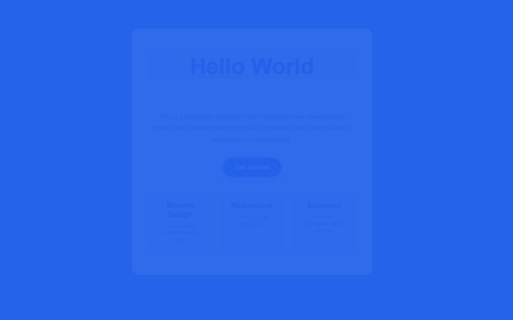

# 产品验收 — 修改网页背景为蓝色并优化文字可读性

## 结果: ✅ 通过

| 项目 | 值 |
|------|------|
| 评分 | 8/10 (通过线: 6) |
| 状态 | acceptance_passed |

## 反馈
页面成功运行，背景已修改为蓝色，文字在蓝色背景下具有良好的可读性。功能完全符合需求描述，页面标题和内容正常显示，整体效果良好。

## 检查清单
  1. 入口文件（index.html/main.py）是否存在且可运行
  2. 代码功能是否覆盖需求描述中的所有要点
  3. 代码风格和命名是否规范
  4. 是否有明显的 bug 或安全问题

## 运行效果截图

## 问题
无
