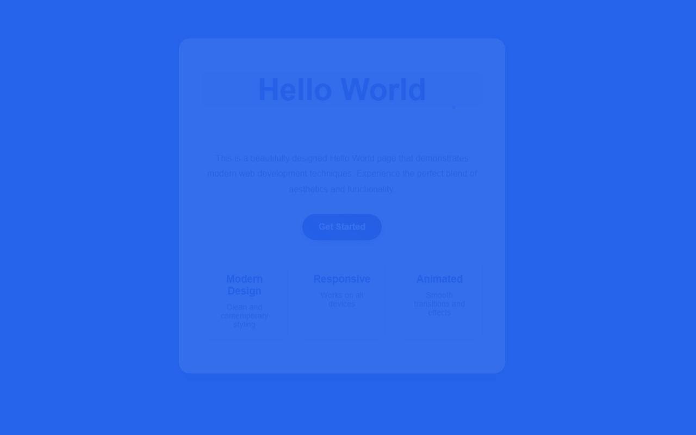

# 开发笔记 — 修改网页背景为蓝色并优化文字可读性

> 2026-04-16 20:15 | LLM

## 产出文件
- [index.html](/app#repo?file=index.html) (4963 chars)

## 自测: 自测 6/6 通过 ✅

| 检查项 | 结果 | 说明 |
|--------|------|------|
| 文件产出 | ✅ | 1 个文件 |
| 入口文件 | ✅ | 存在 |
| 代码非空 | ✅ | 通过 |
| 语法检查 | ✅ | 通过 |
| 文件名规范 | ✅ | 全英文 |
| 页面截图 | ✅ | 1 张截图 |

## 页面预览截图

