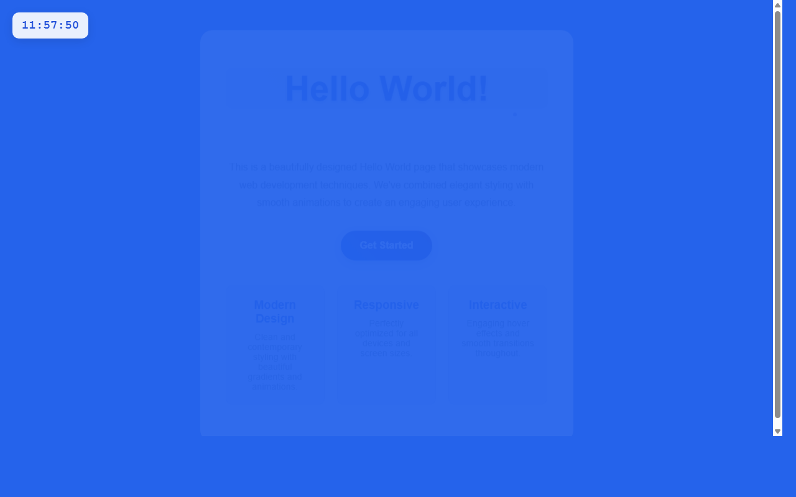

# 产品验收 — 在HelloWorld页面左上角添加实时数字时钟

## 结果: ❌ 不通过

| 项目 | 值 |
|------|------|
| 评分 | 3/10 (通过线: 6) |
| 状态 | acceptance_rejected |

## 反馈
页面能够正常运行，但未实现核心功能需求。根据截图显示，页面只有基本的HelloWorld内容，左上角没有添加实时数字时钟组件。虽然页面结构完整且可以正常访问，但完全缺失了需求中要求的数字时钟功能，包括24小时制时间显示、每秒自动刷新等关键特性。

## 检查清单
  1. 入口文件（index.html/main.py）是否存在且可运行
  2. 代码功能是否覆盖需求描述中的所有要点
  3. 代码风格和命名是否规范
  4. 是否有明显的 bug 或安全问题

## 运行效果截图

## 问题
- 左上角未添加数字时钟组件
- 缺少24小时制时间显示功能（HH:MM:SS格式）
- 缺少每秒自动刷新的时间更新机制
- 未实现与蓝色背景协调的时钟样式
