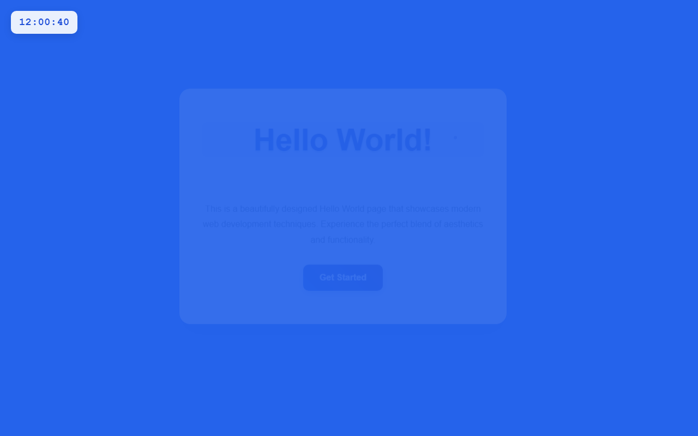

# 产品验收 — 在HelloWorld页面左上角添加实时数字时钟

## 结果: ❌ 不通过

| 项目 | 值 |
|------|------|
| 评分 | 3/10 (通过线: 6) |
| 状态 | acceptance_rejected |

## 反馈
页面能够正常运行，但核心功能未实现。虽然页面标题和内容可以正常显示，但需求中要求的数字时钟组件完全缺失。页面左上角没有显示任何时钟，不符合需求描述中的核心要求。

## 检查清单
  1. 入口文件（index.html/main.py）是否存在且可运行
  2. 代码功能是否覆盖需求描述中的所有要点
  3. 代码风格和命名是否规范
  4. 是否有明显的 bug 或安全问题

## 运行效果截图

## 问题
- 页面左上角没有数字时钟组件
- 缺少24小时制时间显示（HH:MM:SS格式）
- 没有实现每秒自动刷新的时钟功能
- 核心需求功能完全未实现
