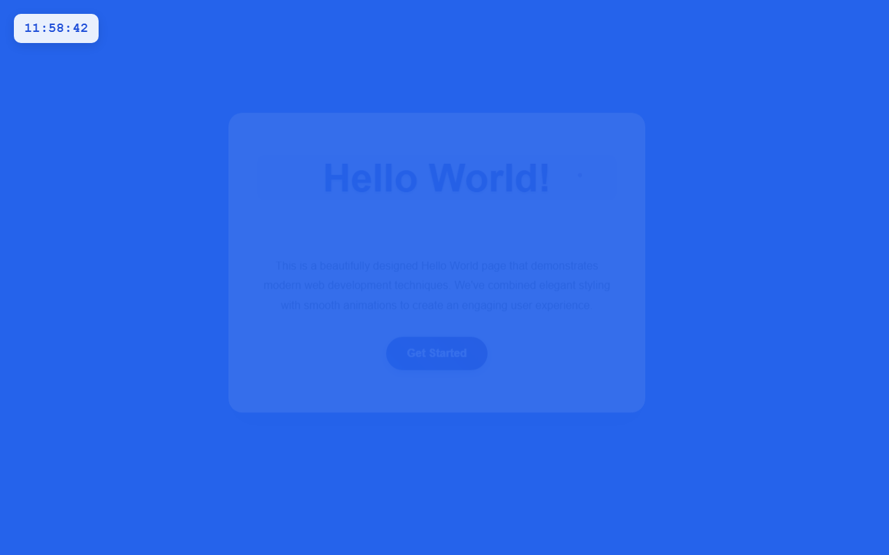

# 开发笔记 — 在HelloWorld页面左上角添加实时数字时钟

> 2026-04-20 11:58 | LLM

## 产出文件
- [clock.js](/app#repo?file=clock.js) (2606 chars)
- [index.html](/app#repo?file=index.html) (4579 chars)

## 自测: 自测 6/6 通过 ✅

| 检查项 | 结果 | 说明 |
|--------|------|------|
| 文件产出 | ✅ | 2 个文件 |
| 入口文件 | ✅ | 存在 |
| 代码非空 | ✅ | 通过 |
| 语法检查 | ✅ | 通过 |
| 文件名规范 | ✅ | 全英文 |
| 页面截图 | ✅ | 1 张截图 |

## 代码变更 (Diff)

### clock.js (新建, 2606 chars)
```
+ // clock.js - 数字时钟组件
+ // 用途：在HelloWorld页面左上角显示实时数字时钟
+ 
+ class DigitalClock {
+     constructor() {
+         this.clockElement = null;
+         this.intervalId = null;
+         this.init();
+     }
+ 
+     // 初始化时钟
+     init() {
+         this.createClockElement();
+         this.startClock();
+     }
+ 
+     // 创建时钟DOM元素
+     createClockElement() {
+         // 检查是否已存在时钟元素
+         if (document.querySelector('.digital-clock')) {
+ ... (更多)
```

### index.html (修改)
```diff
--- a/index.html
+++ b/index.html
@@ -103,5 +103,50 @@
         .cta-button {

             display: inline-block;

             padding: 15px 30px;

-            backgroun

-... (truncated, 5741 chars)
+            background: linear-gradient(45deg, #1d4ed8, #3730a3);

+            color: white;

+            text-decoration: none;

+            border-radius: 50px;

+            font-weight: bold;

+            transition: all 0.3s ease;

+            box-shadow: 0 4px 15px rgba(29, 78, 216, 0.3);

+        }

+

+        .cta-button:hover {

+            transform: translateY(-2px);

+            box-shadow: 0 8px 25px rgba(29, 78, 216, 0.4);

+        }

+    </style>

+</head>

+<body>

+    <div class="digital-clock" id="digitalClock">

+        00:00:00

+    </div>

+

+    <div class="container">

+        <h1 class="hello-world">Hello World!</h1>

+        <p class="subtitle">Welcome to our amazing web experience</p>

+        <p class="welcome-text">

+            This is a beautifully designed Hello World page that demonstrates modern web development techniques. 

+            We've combined elegant styling with smooth animations to create an engaging user experience.

+        </p>

+        <a href="#" class="cta-button">Get Started</a>

+    </div>

+

+    <script>

+        function updateClock() {

+            const now = new Date();

+            const hours = now.getHours().toString().padStart(2, '0');

+            const minutes = now.getMinutes().toString().padStart(2, '0');

+            const seconds = now.getSeconds().toString().padStart(2, '0');

+            

+            const timeString = `${hours}:${minutes}:${seconds}`;

+            document.getElementById('digitalClock').textContent = timeString;

+        }

+

+        // 更新时钟

... (共 55 行变更)
```

## 页面预览截图



