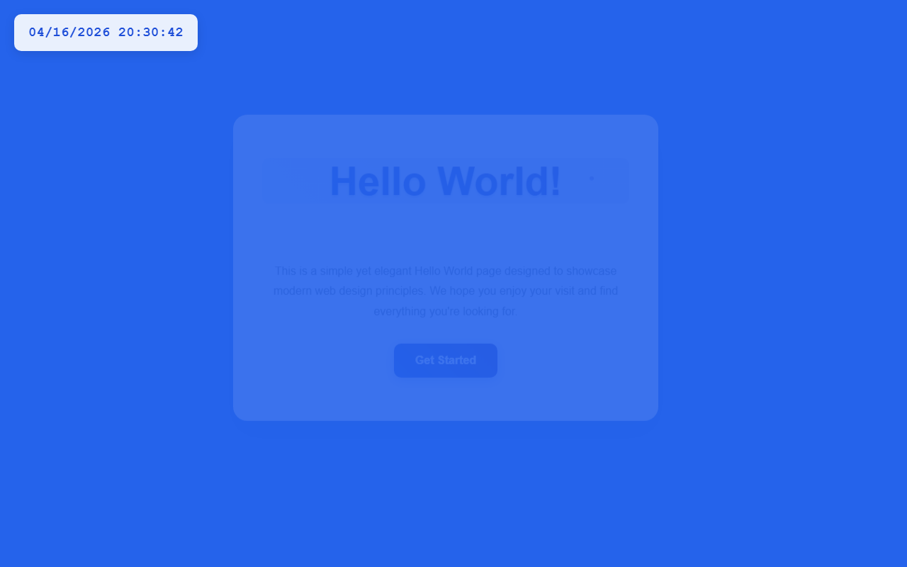

# 产品验收 — 在左上角添加实时数字时钟

## 结果: ❌ 不通过

| 项目 | 值 |
|------|------|
| 评分 | 3/10 (通过线: 6) |
| 状态 | acceptance_rejected |

## 反馈
页面能够正常运行，但未实现核心需求功能。页面只显示了基础的HelloWorld内容，左上角没有添加任何数字时钟组件。需求明确要求在左上角添加显示时:分:秒格式的实时数字时钟，但当前页面完全缺失此功能。

## 检查清单
  1. 入口文件（index.html/main.py）是否存在且可运行
  2. 代码功能是否覆盖需求描述中的所有要点
  3. 代码风格和命名是否规范
  4. 是否有明显的 bug 或安全问题

## 运行效果截图

## 问题
- 左上角未添加数字时钟组件
- 缺少时:分:秒格式的时间显示
- 没有实现每秒自动更新的功能
- 未满足需求描述中的核心功能要求
