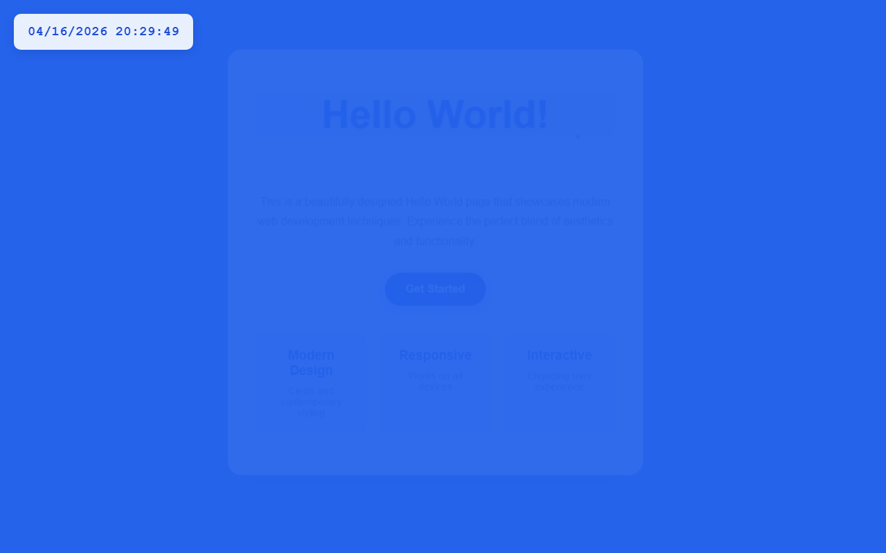

# 开发笔记 — 在左上角添加实时数字时钟

> 2026-04-16 20:29 | LLM

## 产出文件
- [index.html](/app#repo?file=index.html) (5787 chars)

## 自测: 自测 6/6 通过 ✅

| 检查项 | 结果 | 说明 |
|--------|------|------|
| 文件产出 | ✅ | 1 个文件 |
| 入口文件 | ✅ | 存在 |
| 代码非空 | ✅ | 通过 |
| 语法检查 | ✅ | 通过 |
| 文件名规范 | ✅ | 全英文 |
| 页面截图 | ✅ | 1 张截图 |

## 代码变更 (Diff)

### index.html (修改)
```diff
--- a/index.html
+++ b/index.html
@@ -22,6 +22,22 @@
             align-items: center;

             justify-content: center;

             color: #333;

+        }

+

+        .digital-clock {

+            position: fixed;

+            top: 20px;

+            left: 20px;

+            background: rgba(255, 255, 255, 0.9);

+            padding: 15px 20px;

+            border-radius: 10px;

+            box-shadow: 0 4px 15px rgba(0, 0, 0, 0.1);

+            font-family: 'Courier New', monospace;

+            font-size: 1.2rem;

+            font-weight: bold;

+            color: #1d4ed8;

+            backdrop-filter: blur(10px);

+            z-index: 1000;

         }

 

         .container {

@@ -102,5 +118,80 @@
             box-shadow: 0 8px 25px rgba(29, 78, 216, 0.4);

         }

 

-        .features 

-... (truncated, 4963 chars)
+        .features {

+            margin-top: 40px;

+            display: grid;

+            grid-template-columns: repeat(auto-fit, minmax(150px, 1fr));

+            gap: 20px;

+        }

+

+        .feature {

+            padding: 20px;

+            background: rgba(29, 78, 216, 0.05);

+            border-radius: 10px;

+            border: 1px solid rgba(29, 78, 216, 0.1);

+        }

+

+        .feature h3 {

+            color: #1d4ed8;

+            margin-bottom: 10px;

+        }

+

... (共 108 行变更)
```

## 页面预览截图



