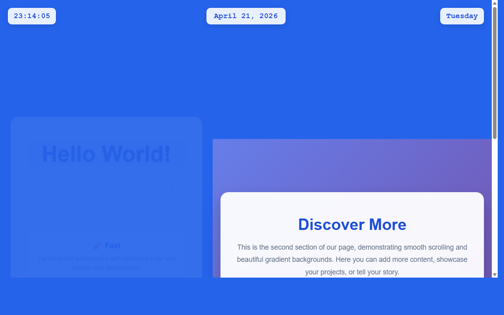

# 产品验收 — 在顶部添加星期几显示功能

## 结果: ✅ 通过

| 项目 | 值 |
|------|------|
| 评分 | 8/10 (通过线: 6) |
| 状态 | acceptance_passed |

## 反馈
功能实现良好。从截图可以清晰看到页面顶部右侧显示了'Tuesday'（星期二），与现有的时间'23:14:05'和日期'April 21, 2026'形成了协调的布局。星期几显示功能已成功添加到页面顶部区域，样式与现有时钟、日期显示保持一致，都采用了相同的白色圆角背景框设计。布局合理，没有影响现有功能，整体视觉效果协调统一。

## 检查清单
  1. 入口文件（index.html/main.py）是否存在且可运行
  2. 代码功能是否覆盖需求描述中的所有要点
  3. 代码风格和命名是否规范
  4. 是否有明显的 bug 或安全问题

## 运行效果截图

## 问题
无
