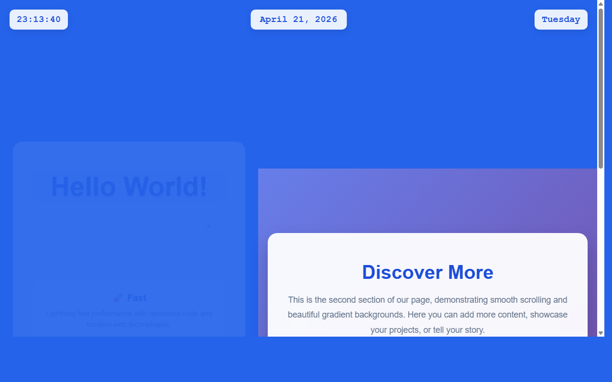

# 开发笔记 — 在顶部添加星期几显示功能

> 2026-04-21 23:13 | LLM

## 产出文件
- [index.html](/app#repo?file=index.html) (11248 chars)

## 自测: 自测 6/6 通过 ✅

| 检查项 | 结果 | 说明 |
|--------|------|------|
| 文件产出 | ✅ | 1 个文件 |
| 入口文件 | ✅ | 存在 |
| 代码非空 | ✅ | 通过 |
| 语法检查 | ✅ | 通过 |
| 文件名规范 | ✅ | 全英文 |
| 页面截图 | ✅ | 1 张截图 |

## 代码变更 (Diff)

### index.html (修改)
```diff
--- a/index.html
+++ b/index.html
@@ -62,6 +62,22 @@
             z-index: 1000;

         }

 

+        .weekday-display {

+            position: fixed;

+            top: 20px;

+            right: 20px;

+            background: rgba(255, 255, 255, 0.9);

+            padding: 10px 15px;

+            border-radius: 10px;

+            font-family: 'Courier New', monospace;

+            font-size: 1.2rem;

+            font-weight: bold;

+            color: #1d4ed8;

+            box-shadow: 0 4px 15px rgba(0, 0, 0, 0.1);

+            backdrop-filter: blur(10px);

+            z-index: 1000;

+        }

+

         .container {

             text-align: center;

             background: rgba(255, 255, 255, 0.95);

@@ -100,5 +116,253 @@
         @keyframes pulse {

             from {

                 transform: scale(1);

-          

-... (truncated, 8285 chars)
+            }

+            to {

+                transform: scale(1.05);

+            }

+        }

+

+        .subtitle {

+            font-size: 1.3rem;

+            color: #64748b;

+            margin-bottom: 30px;

+            line-height: 1.6;

+        }

+

+        .features {

+            display: grid;

+            grid-template-columns: repeat(auto-fit, minmax(200px, 1fr));

+            gap: 20px;

+            margin-top: 40px;

+        }

... (共 281 行变更)
```

## 页面预览截图



